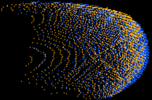
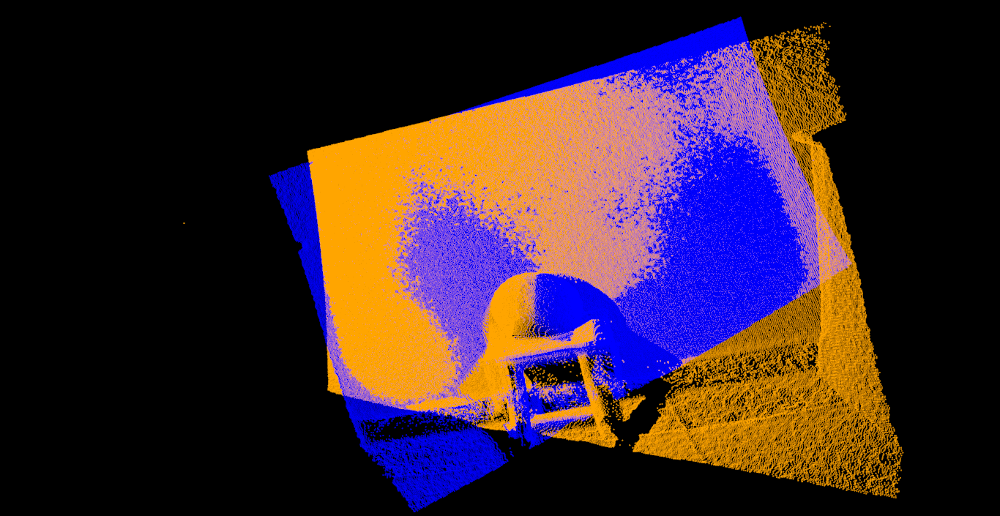

# CEC-Optimizer-Example

## Environment

- [Kinect for Windows SDK](https://www.microsoft.com/en-us/download/details.aspx?id=44561) =  2.0
- [Point Cloud Library](https://github.com/PointCloudLibrary/pcl/releases/tag/pcl-1.9.1) =  1.9.1
  - [Boost](https://github.com/boostorg/boost/releases/tag/boost-1.68.0) =  1.68
  - [Eigen](https://gitlab.com/libeigen/eigen/-/releases/3.3.7) =  3.3.7
  - [FLANN](https://github.com/mariusmuja/flann/releases/tag/1.8.4) =  1.8.4
  - [Qhull](https://github.com/qhull/qhull/releases/tag/v7.3.0) =  7.3.0
  - [VTK](https://github.com/Kitware/VTK/releases/tag/v8.1.1) =  8.1.1
  - [OPENNI2](https://github.com/OpenNI/OpenNI2) =  2.2
- [.NET Core SDK](https://versionsof.net/core/3.1/3.1.2/) >=  3.1.2

## Data Preparation

- The Data grabbed from the Kinect V2 by using [Kinect V2 Pcl Grabber](https://github.com/wz18207/kinect_v2_pcl_grabber).

## Set Up

- Download and install the Point Cloud Library from [PCL](https://github.com/PointCloudLibrary/pcl/releases/tag/pcl-1.9.1) and locate under `C:/Program Files/PCL 1.9.1/`.
- Download and install the Kinect for Windows SDK v2.0 from [Kinect v2 SDK](https://www.microsoft.com/en-us/download/details.aspx?id=44561).
- Download and install the OPENNI2 from [OPENNI2](https://github.com/OpenNI/OpenNI2).

## Build and Run

- Clone this repository:

  ```
  git clone https://github.com/yourusername/CEC-Optimizer-Example.git
  cd CEC-Optimizer-Example
  ```
- Build and install the project:

```
  mkdir build
  cd build
  cmake .. -DCMAKE_BUILD_TYPE=Release
  cmake --build . --config Release --prefix "/Your/Install/Path"
```

## Implementation Details

- The Kinect Data grabbed from [Kinect V2 Grabber](https://github.com/wz18207/kinect_v2_pcl_grabber)

## Performance





| Algorithms        | Charmfer Distance  | Hausdorff Distance |
| ----------------- | ------------------ | ------------------ |
| mLSHADE+LM-KRSL   | 0.426±0.129       | 0.484±0.103       |
| mLSHADE+LM-KRSMPL | 0.471±0.139 |  0.598±0.117             |
| mLSHADE+LM-MCC | 0.461±0.089 |  0.515±0.059             |
| SHADE+LM-KMPE | 0.057±0.029 |  0.053±0.025             |
| mLSHADE+LM-KMPE | 0.031±0.011 |  0.045±0.009             |

## License

Copyright © 2025 Zhaoyang Wang.

Distributed under the [MIT License](http://www.opensource.org/licenses/mit-license.php).

## Contact

- [Zhaoyang Wang](wz18207@outlook.com)

## Reference

- [Kinect2Grabber](https://github.com/UnaNancyOwen/KinectGrabber) by UnaNancyOwen
- [openni_grabber](https://github.com/PointCloudLibrary) by Point Cloud Library
- [NaturalSoftware.Kinect.PCL](https://github.com/NaturalSoftwareJP/NaturalSoftware.Kinect.Cpp) by Natural Software
- [Levenberg-Marquardt Algorithm](https://github.com/svenpilz/LevenbergMarquardt/blob/master/LevenbergMarquardt.h) by Sven Pilz

<!-- Citation  -->

<!-- If you find this work useful for your research, please cite -->
